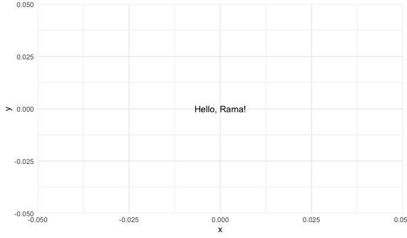

# Package Information
### Title of package 
greetings

### Author
Stephanie Hicks 

### Goal 
Create a graph called greetings

# Package in Use
### Exported function
`hello`: This function make a plot with a greeting to the name passed as an argument to the function 

### Example

>hello("Rama")

# Links
### Original GitHub link
https://github.com/stephaniehicks/greetings/tree/main

### URL of deployed website
https://github.com/jhu-statprogramming-fall-2023/biostat777-project3-part1-ramaalhariri.git

# 5 things I customized
`1`: Created a minty theme using bootswatch 

`2`: Added my github link to the right of my search bar

